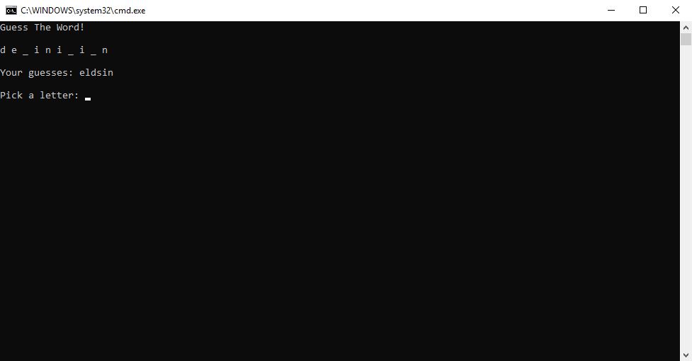

# Lab03-Word-Guess-Game
**Author**: Ben Taylor  
**Version**: 1.0.0

## Overview
A command-line word guessing game.

## Getting Started
1. Create a fork of this repository, and clone your fork to your device.
2. Open the solution file `GuessingGame.sln` in Visual Studio.
3. To run the app, go to `Debug` > `Start Without Debugging` (or press Ctrl+f5).
4. For testing, navigate to the `GuessingGameTests` project using the Solution Explorer.
5. To run the tests, go to `Tests` > `Run` > `All Tests` (or press Ctrl+R)

## Using The Application

1. Upon starting the application, you will be greeted by the main menu. Pressing 1 here will start the game, pressing 2 will take you to the admin menu, and pressing 3 will exit the application.
2. When you start the game, you will see multiple blanked out letters, and the game will prompt you to guess a letter. Enter a letter, and if your letter is in the word it will be un-blanked. The game will also keep track of the letters you have already guessed. The game ends when all of the letters have been un-blanked.
3. In the admin menu, you can view all of the words in the game, and you can modify that list by adding and removing words. The user can also return the word list to a default state here.

## Architecture
**Languages Used**:
* C# 7.3 (.NET Core 2.2)

Written with Visual Studio Community 2017.

## Change Log
* [DATETIME] - [CHANGE]